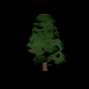
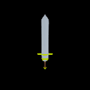
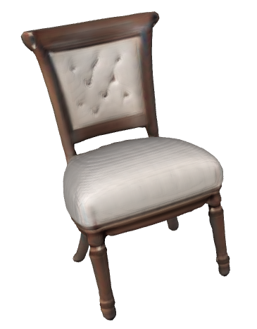
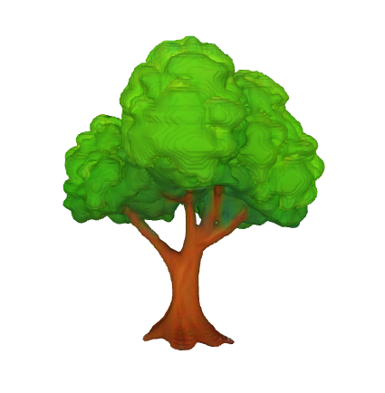
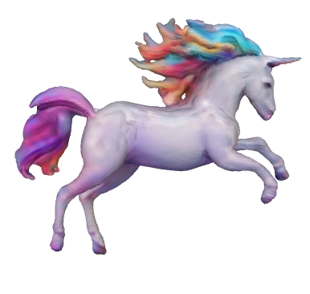
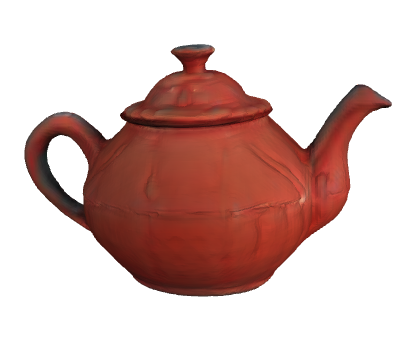
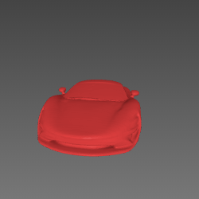
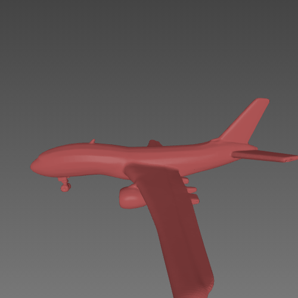

# 3D Model Generation from Images & Text

This project demonstrates **3D mesh generation** using three different pipelines: **SHAP-E**, **TripoSR**, and **Hunyuan3D**. Each Colab notebook walks you through the required steps to generate `.obj` or 3D mesh files from an image or a text prompt.

---

## Notebooks

> Please make sure you're logged into your Google account before opening Colab notebooks.

###  [SHAP-E (Colab)](https://colab.research.google.com/drive/1XyRnT4VGa4tYQnDZJzIqdAePIv3OImyr?usp=sharing)
- Converts **text or images into 3D meshes** using OpenAI's SHAP-E model.
- Just run all cells and follow the  instructions.
- basic texture and mesh

###  [TripoSR (Colab)](https://colab.research.google.com/drive/1MRzyB5sx3oWQZAuUp9mXt6yT8LTvcAtz?usp=sharing)
- Converts text into image then into 3D meshes** **clean `.obj` mesh** using TripoSR.
- good texture and mesh.
- make mc-rsolution to 512 and texture-resolution to 4196 in run.py for best result(18gb vram required)
- needs hugging face token

###  [Hunyuan3D (Colab)](https://colab.research.google.com/drive/1uHnvxtnxshJPodW3Q0P725HqGmNZNqQ4?usp=sharing)
- High-fidelity 3D mesh generator.
- best for **ultra-detailed and artistic 3D outputs**.
- use 3d paint to add texture photorealistic and beautiful (24gb vram)
- needs hugging face token

---
## Output Previews

### SHAP-E Output

  
  

  Tree model generated from prompt using SHAP-E.  
   
  Sword model generated using SHAP-E text-to-3D.
   
  2min avg generation time

---

### TripoSR Output

  png of 3d obj model

  
  
  
  

  Chair   | Tree   | Unicorn  | Teapot | 20sec avg

---

### Hunyuan3D Output

  
  
  
  

  Jet | Car | Airplane | Tank 
  

 
  ultrarealistic mesh generated in 3min avg

